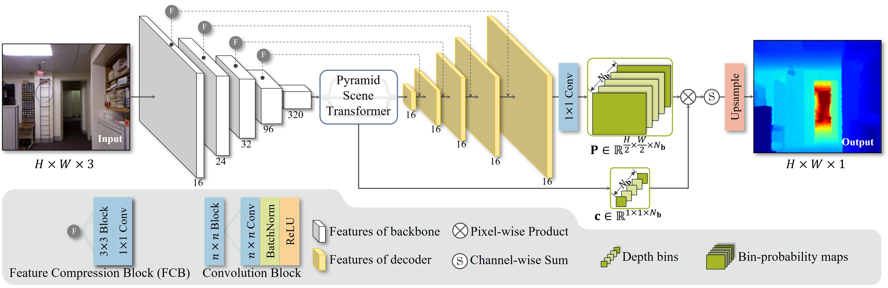
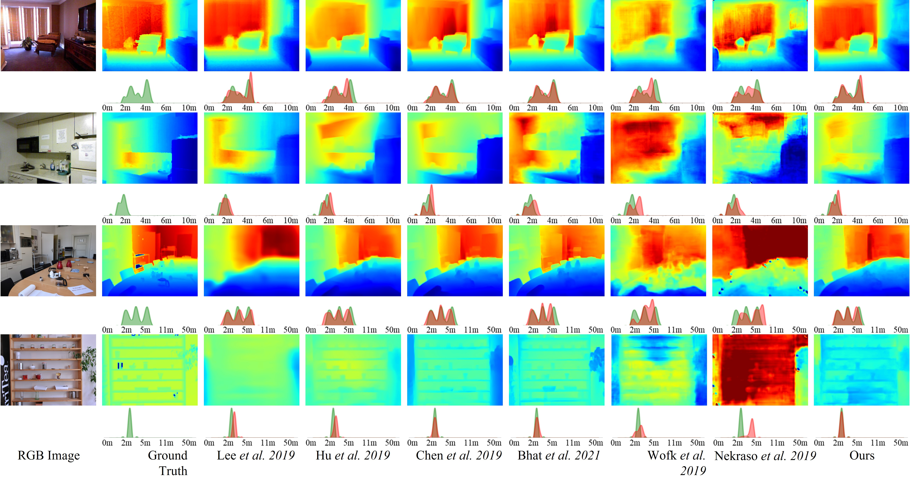

# DANet: Monocular Depth Distribution Alignment with Low Computation
This is the implementation of the paper [***Monocular Depth Distribution Alignment with Low Computation***](https://arxiv.org/abs/2203.04538), ***ICRA 2022, Fei Sheng, Feng Xue, and Yicong Chang and Wenteng Liang
and Anlong Ming.***


## Contents
1. [Introduction](#introduction)<br>
2. [Usage](#usage)<br>
3. [Results](#Results)<br>
4. [Acknowledgements](#Acknowledgements)<br>

## Introduction
This repository provides the implementation of DANet in PyTorch.

Monocular depth estimation has been widely applied in many computer vision and robotics tasks. DANet is proposed to achieve a trade-off between speed and accuracy in this task.




## Usage

### Dependencies
- Python3.8
- PyTorch(1.10.0)
- Pytorch3d(0.6.1)
- Pandas(1.4.1)
- Scipy(1.6.2)
- skimage
- sklearn
- Wandb

### Pre-processed Data
You can download the NYUD v2 and iBims-1 dataset from [Google Drive](https://drive.google.com/file/d/1-4NWtcQOa9vj4yoIr_dBtQ6LQ5qdMtgQ/view?usp=sharing) or 
[Baidu Netdisk](https://pan.baidu.com/s/1z5J4BPqdqWxqg4PEzlJuIA?pwd=dp53) (Code: dp53).  
Then please unzip the data folder and replace the ./data folder.

### Train
As an example, use the following command to train DANet on NYUDV2.<br>

	CUDA_VISIBLE_DEVICES="0,1" python train.py --logging (wandb logging during training)
						
### Evaluation
Use the following command to evaluate the trained DANet on NYUDV2 test data.<br>

	CUDA_VISIBLE_DEVICES="0" python evaluate.py --loadckpt (the path of the loaded model)

Use the following command to evaluate the trained DANet on iBims-1 test data.<br>

	CUDA_VISIBLE_DEVICES="0" python evaluate_ibims1.py --loadckpt (the path of the loaded model)
### Pretrained Model
You can download the pretrained model from
[Google Drive](https://drive.google.com/file/d/1SJ-JZz3ScAkpgKfRpUWGfZQF-DswsNLM/view?usp=sharing) or 
[Baidu Netdisk](https://pan.baidu.com/s/1xg5qY8eNK0F1uto7Pkwfxg?pwd=zjfy) (Code: zjfy)

## Results

## Some examples


## Citation
```
@inproceedings{Sheng2022DANet,
             title = {Monocular Depth Distribution Alignment with Low Computation},
             author = {Fei Sheng, Feng Xue, and Yicong Chang and Wenteng Liang
and Anlong Ming},
	     conference={IEEE International Conference on Robotics and Automation (ICRA)},
             year = {2022}   
} 
```
## Acknowledgements
The source code of mini Vit in our method follows [work](https://github.com/shariqfarooq123/AdaBins). Our work is inspired by this work and part of codes.
	
